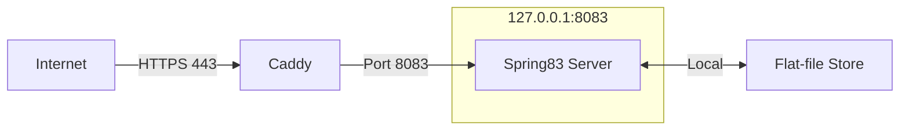
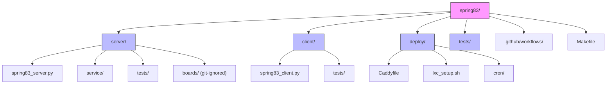

# Spring '83 Home‑Lab Stack

A minimal, reproducible reference implementation of the [Spring '83](https://github.com/robinsloan/spring-83) protocol designed to run self-hosted on a Proxmox cluster.

## About Spring '83

Spring '83 is a simple protocol for publishing and distributing small web pages (boards) that was created by Robin Sloan. This reference implementation follows the [June 2022 draft specification](https://github.com/robinsloan/spring-83/blob/main/draft-20220629.md) and focuses on the core "happy path" functionality.

Spring '83 was designed as an alternative to existing social media paradigms, enabling a simple way to follow people online while avoiding the problems of timelines, RSS, and email. The protocol emphasizes simplicity, creativity, and user expression over engagement metrics.

Key protocol characteristics:
- Uses Ed25519 cryptographic keypairs for identity and authorization
- Boards are HTML fragments limited to 2,217 bytes
- No JavaScript or external resources allowed
- Each publisher maintains a single board that can be updated
- Cryptographically signed to ensure content authenticity
- Designed for a decentralized, federated network
- Ephemeral content model with no built-in interaction mechanisms
- No formal relationship tracking or following mechanisms

Spring '83 intentionally lacks common social media features like likes, replies, or persistent history, encouraging creators to develop their own methods of interaction. This design philosophy prioritizes a "gentle flowing stream" of content over information hoarding and traditional engagement metrics.

## Features

- **Python Server**: Implements Spring '83 GET/PUT/OPTIONS endpoints with signature verification
- **Python CLI Client**: Fetches boards from URLs listed in `~/.83`
- **Infrastructure as Code**: Deploys behind Caddy 3 with automatic HTTPS
- **Automation**: systemd services, log rotation, and cron TTL cleanup
- **CI Pipeline**: GitHub Actions for linting, testing, and container builds

## Quick Start

### Dependencies

- Python 3.9 or later
- Pure-Python implementation of Ed25519 (vendored)
- For deployment: Proxmox VE, Debian 12

### Development Setup

```bash
# Clone the repository
git clone https://github.com/clintecker/python-springlet.git
cd python-springlet

# Set up the virtual environment and dependencies
make setup

# Run tests
make test

# Run linting
make lint
```

### Running Locally

**Server:**
```bash
# Start the server on 127.0.0.1:8083 with boards stored in ./server/boards
python server/spring83_server.py --boards-dir ./server/boards
```

**Client:**
```bash
# Create a config file with board URLs
echo "http://localhost:8083/ab589f4dde9fce4180fcf42c7b05185b0a02a5d682e353fa39177995083e0583" > ~/.83

# Fetch boards
python client/spring83_client.py
```

**Publishing a Board:**
```bash
# Create a keypair (using the Ed25519 algorithm)
# The key must end with "83e" followed by month (01-12) and year (e.g., 2212)
python -c "from pure25519 import eddsa; sk, pk = eddsa.create_keypair(); print(f'Private key: {sk.to_ascii(encoding=\"hex\")}\nPublic key: {pk.to_ascii(encoding=\"hex\")}')"

# Create an HTML board (must be under 2217 bytes)
cat > myboard.html << EOF
<div style="font-family: sans-serif; max-width: 400px; margin: 0 auto; padding: 20px;">
  <h1>My Spring '83 Board</h1>
  <p>Hello, world! This is my first Spring '83 board.</p>
  <time datetime="$(date -u +"%Y-%m-%dT%H:%M:%SZ")">$(date)</time>
</div>
EOF

# Sign and publish your board (replace KEY with your public key)
curl -X PUT \
  -H "Content-Type: text/html" \
  -H "Spring-Version: 83" \
  -H "Spring-Signature: YOUR_SIGNATURE_HERE" \
  --data-binary @myboard.html \
  http://localhost:8083/YOUR_PUBLIC_KEY
```

### Deployment to Proxmox

```bash
# Create LXC container on Proxmox (one-time setup)
make lxc

# Deploy the server, client, and configuration
make deploy
```

## Architecture



The Spring '83 stack consists of:
- A Python server that listens on 127.0.0.1:8083
- Caddy 3 as a reverse proxy that handles TLS termination and rate limiting
- Flat file storage for boards with 22-day TTL
- A systemd service for automatic startup and restart

## Protocol Implementation Details

- **Board Validation**: Keys must match regex `^[0-9a-f]{57}83e(0[1-9]|1[0-2])\d{2}$`
- **Key Expiration**: Keys automatically expire after two years based on the month/year suffix
- **Size Limit**: Boards cannot exceed 2217 bytes
- **TTL**: Boards expire after 22 days
- **Validation**: Each board must contain a `<time>` element with ISO-UTC timestamp
- **Special Keys**: Handles infernal key denial and test key responses
- **Security**: All boards must be cryptographically signed with the publisher's private key
- **Client Rendering**: Boards are displayed as HTML with no JavaScript execution

For the complete Spring '83 protocol specification, see:
- [Specifying Spring '83](https://www.robinsloan.com/lab/specifying-spring-83/) - Protocol motivation and philosophy
- [Draft Specification](https://github.com/robinsloan/spring-83/blob/main/draft-20220629.md) - Technical details and implementation guidelines

## Repository Structure



## Makefile Targets

- `make setup`: Create virtual environment and install dependencies
- `make test`: Run unit tests with pytest
- `make lint`: Run linting with ruff
- `make lxc`: Create and configure LXC container on Proxmox
- `make deploy`: Deploy server to configured container

## License

[MIT](LICENSE)